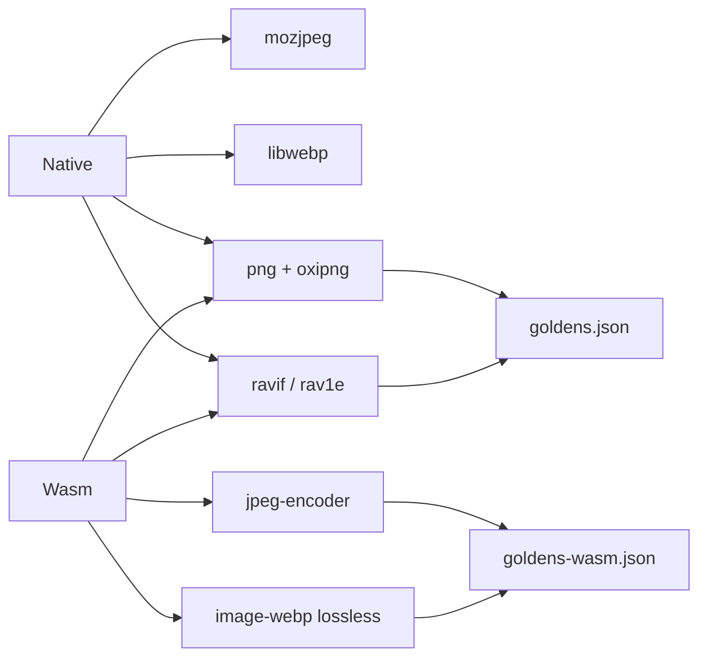

A wasm playground that claims the same bytes as Node looks finished. Then JPEG in the browser is `jpeg-encoder`, not `mozjpeg`, and a designer diffs two exports. Shipping `libwebp` in the browser looks honest. Then the license graph is a second product, and the playground is a native port you cannot run.

[minipix](https://github.com/tomymaritano/minipix) keeps two contracts. The [README](https://github.com/tomymaritano/minipix/blob/develop/README.md) is the table: native vs wasm, per format. PNG and AVIF are byte-identical — hard assert in CI. JPEG is lower density by design. WebP in wasm is lossless-only. The hashes live in a different file.

Byte-identical across languages is written [elsewhere](/writing/byte-identical). This is what the browser is allowed to claim.

## The problem

If the playground pretends to be `libwebp`, a lossless export is a surprise. If wasm JPEG is documented as "close enough" to `mozjpeg`, you have two products and one name. If AVIF decode goes through `libaom` in the browser, you shipped a second runtime.

Native: `mozjpeg`, `libwebp`, `avif-decode` / `libaom`. Wasm: `jpeg-encoder`, `image-webp` lossless-only, AVIF decode delegated to `createImageBitmap`. PNG and AVIF encode stay Rust-pure on both paths. That is why those two still match.

The playground is 100% client-side. Drag an image, convert it, the file never leaves the machine. No server. No telemetry on content. AVIF encode is slow in the browser — single-threaded; `wasm-bindgen-rayon` is later. Safari before 17 cannot convert AVIF. Those limits are in the README. They are not a silent first-frame flatten. Animated WebP is a `Decode` error on both paths.

## One hard decision

**Wasm is not native.** Do not ship `mozjpeg` in the browser so the hashes match. Do not call wasm WebP `libwebp`. PNG and AVIF still match. JPEG and WebP get `goldens-wasm.json`.

If a codec cannot be pure Rust under a permissive license, it is not this playground.

## What I would not do again

Wrap `libwebp` in wasm and call it the same product. Then the license is the product, and the playground is a native port.

Leave JPEG undocumented so "it looks the same at quality 60." Then the designer is the test suite.

## The bar

A table you can read, and a golden that fails when the browser lies. README: [github.com/tomymaritano/minipix](https://github.com/tomymaritano/minipix). Pre-release (`v0.1.0`).
